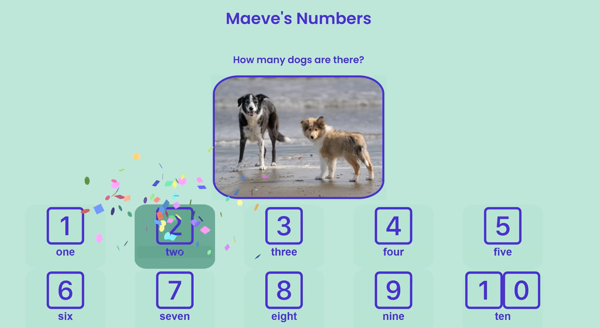

# Numbers Game

A fun, interactive math game built for my 2 year old niece to develop her number recognition with both number symbols (e.g. 1, 2, 3) and the written number (e.g. one, two, three). She loves animals, so a different picture loads with a certain number of animals in it (e.g. 4 ducks or 8 rabbits), the audio of the number is played aloud, and she then selects which tile shows that number. If she gets it wrong the tile shakes, if she gets it correct, the tile explodes with confetti.

## Screenshot

## Features

Numbers and reading
Tap picture to hear the number aloud
Interactive play
Clean, kid-friendly interface
To Add: Difficulty levels to further learning

## Tech Stack

Frontend: React, TypeScript, CSS
Backend: Node.js, Express
Database: SQLite (Knex.js)
Testing: Vitest, React Testing Library

## Why I Built This

My niece needed a way to practice her numbers. This project taught me the importance of user feedback - I have iterated on the design and setup multiple times based on her parents input and her trial plays with it to ensure it was genuinely useful and fun for her.

## Future Improvements

Difficulty levels that either add more numbers (11-20), remove the audio to help, or must select two tiles (the symbol and written word).
Better mobile responsiveness.
New images that are more consistent in style and the same size.
